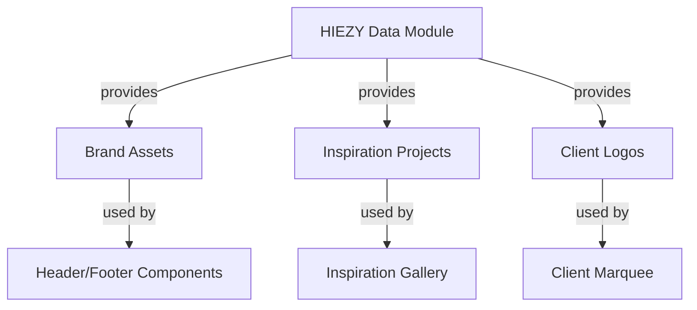

# Content Data

## Content Data Module

### Overview
The **Content Data** module (`data/content.js`) serves as the single source of truth for all editable site content. It centralizes branding assets, inspiration projects, and client logos, allowing the front‑end pages (`index.html`, `inspirations.html`) to reference a consistent data structure without hard‑coding values.

### Data Structure
The exported constant `HIEZY` contains three top‑level sections:

| Section | Purpose | Key Fields |
|---------|---------|------------|
| `brand` | Global brand identifiers | `logo`, `favicon`, `logoAlt`, `name` |
| `inspirations` | Catalog of design inspirations, grouped by category (`landing`, `ecommerce`, `dashboards`) | Each project includes `title`, `description`, `tags`, `img1`, `img2`, `pdf` |
| `clients` | Marquee strip of client logos | Each entry has `name` and `src` (image path) |

All paths follow the folder rule:
- **Thumbnails**: `assets/inspirations/<category>/<filename>.png`
- **PDFs**: `assets/inspirations/<category>/<filename>.pdf`
- **Brand assets**: `assets/images/brand/...`
- **Client logos**: `assets/images/clients/...`

### Key Components
- **`HIEZY.brand`** – Provides logo, favicon, alt text, and brand name for header/footer components.
- **`HIEZY.inspirations.<category>`** – Arrays of project objects used by the inspiration gallery component to render cards, images, and optional PDF downloads.
- **`HIEZY.clients`** – Array of logo objects consumed by the client marquee component to display partner logos.

### Usage
1. **Adding/Editing Projects**  
   - Insert a new object into the appropriate category array (`landing`, `ecommerce`, `dashboards`).  
   - Populate `title`, `description`, `tags`, `img1`, `img2`, and optionally `pdf`.  
   - Ensure image paths adhere to the folder rule.

2. **Modifying Brand Assets**  
   - Update `logo`, `favicon`, `logoAlt`, or `name` in `HIEZY.brand`.  
   - The UI components that reference these values will automatically reflect the changes.

3. **Updating Client Logos**  
   - Add, remove, or replace objects in the `clients` array.  
   - The marquee component iterates over this array to render each logo.

### Integration Points
- **Inspiration Pages** (`inspirations.html`) import the `HIEZY` object to populate project cards dynamically.  
- **Landing Page** (`index.html`) reads `HIEZY.brand` for header branding and `HIEZY.clients` for the client strip.  
- No runtime dependencies or function calls are required; the module is purely data‑driven.

### Extending the Module- To support additional categories, add a new top‑level key under `inspirations` and populate it with project objects following the same schema.  
- For multilingual content, consider adding a `translations` sub‑object within each project and update consuming components accordingly.

### Example Code Snippet
```javascript
// Access a specific inspiration project
const tourismProject = HIEZY.inspirations.landing[0];
console.log(tourismProject.title); // "Tourism Website"

// Retrieve a client logoconst firstClientLogo = HIEZY.clients[0].src;
```

### Architecture Diagram


*The diagram illustrates the one‑way data flow from the central `HIEZY` object to the various UI components that consume it.*