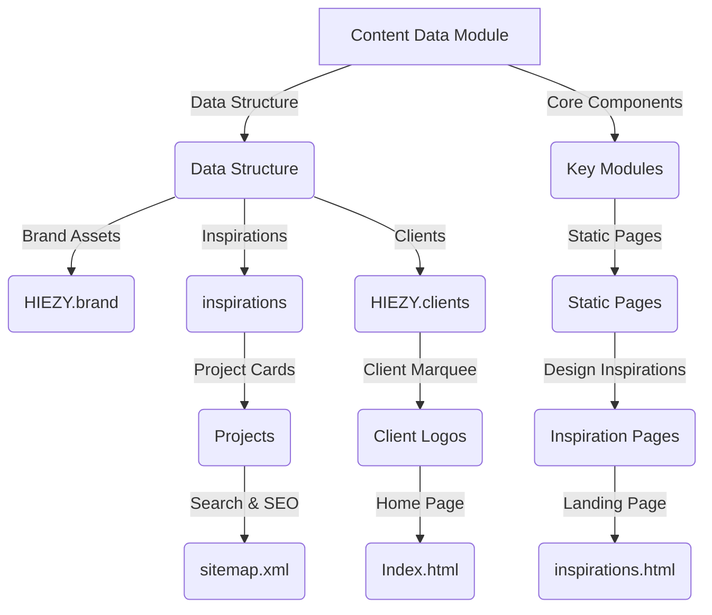

# HIEZY_Web_Solutions_—_Affordable_Websites_and_Softwares_for_Small_to_Medium_Businesses — Wiki

# HIEZY Web Solutions – Affordable Websites & Software for Small to Medium Businesses

Welcome to the **Content Data** module of the HIEZY Web Solutions project. This is your entry point to understanding how the site’s content is managed, stored, and displayed. The module is designed to be intuitive, with clear navigation to all core components.

## What You’ll Find Here

- **Centralized Content Management**: The `data/content.js` file acts as the single source of truth for all editable site content.
- **Structured Data Flow**: Content is organized into three main sections—branding, inspirations, and clients—each following a consistent folder structure.
- **Key Modules Explained**: Learn how to add projects, update brand assets, manage client logos, and integrate dynamic data.
- **Integration Guide**: See how the inspiration gallery, client marquee, and landing pages pull data from this module.
- **Example Usage**: A short snippet shows how to access a project or logo from the module.

## Architecture Overview (Mermaid)

## Quick Setup & Usage

- **Adding Projects**: Insert new objects into `HIEZY.inspirations.landing`, `HIEZY.inspirations.ecommerce`, etc.
- **Updating Branding**: Modify `HIEZY.brand.logo` or `favicon` to reflect your brand.
- **Client Logos**: Edit `HIEZY.clients` to add or remove partner logos.
- **Static Pages**: Use `HIEZY.brand` for headers and `HIEZY.clients` for the client strip.

## Next Steps

Explore the module pages to dive deeper into each component. This structure ensures scalability and easy maintenance as your website grows.

For more details, visit the [Content Data documentation](module-slug.md).

---

Feel free to ask if you’d like a deeper dive into any specific module or component!