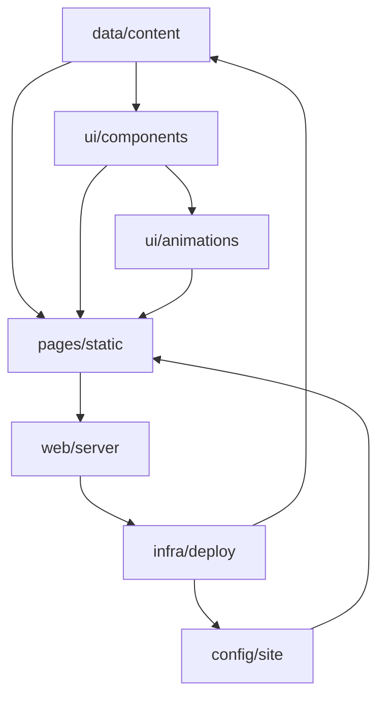

# HIEZY_Web_Solutions_—_Affordable_Websites_and_Softwares_for_Small_to_Medium_Businesses — Wiki

# HIEZY_Web_Solutions — Affordable Websites and Softwares for Small to Medium Businesses

Welcome to the HIEZY Web Solutions repository. This is the single source of truth for our affordable, template‑driven websites aimed at small and medium businesses. The project is organized into focused modules that separate content, presentation, and configuration, enabling fast updates and consistent branding across static pages.

## High-Level Architecture

The site is built from a small set of core modules that work together to render pages with minimal runtime complexity:

## Modules and Key Flows

### [Content Data](data/content.md)
The **Content Data** module (`data/content.js`) is the single source of truth for all editable site content. It provides a global `HIEZY` object with `brand`, `inspirations`, and `clients`, ensuring consistent references across pages without hard‑coded values. Use it to add projects, update branding, or manage client logos.

### [Static Pages](pages/static.md)
The **Static Pages** module (`index.html` and `inspirations.html`) delivers the public‑facing interface. It renders the home, services, and inspiration hub, and powers interactions such as preloader, navigation, mobile sheet, 3‑D tilt, video overlay, form wizard, scroll‑based progress, back‑to‑top, and scroll‑reveal animations. It consumes `HIEZY` for dynamic content and includes third‑party widgets.

### [Site Configuration](config/site.md)
The **Site Configuration** module defines how search engines and crawlers interact with the site via `robots.txt` and `sitemap.xml`. These static assets are served directly by the web server and are essential for discoverability and indexing.

### UI Components and Animations
Reusable UI components and animation modules keep the visual language consistent. They are wired into the static pages and driven by data from the Content Data module, enabling dynamic galleries, branded headers, and client marquees with minimal JavaScript.

## Setup and Contribution

To work with the repository:
- Ensure file paths follow the established folder rules for images, PDFs, and brand assets.
- Update `data/content.js` to modify content; the static pages will reflect changes automatically.
- Extend categories in the Content Data module by adding new top‑level keys and following the existing schema.

This structure keeps the codebase approachable while supporting clear navigation paths for designers and developers.